<div align="center">

# 🏢 RentHub

### Система управления арендой оборудования

[](https://www.typescriptlang.org/)
[](https://nestjs.com/)
[](https://react.dev/)
[](https://www.postgresql.org/)
[](https://github.com/AkonitVerse/RentHub/blob/main/LICENSE)
[](https://github.com/features/actions)

[Быстрый старт](#11-инициализация-проекта) • [Документация](docs/) • [API Docs](http://localhost:3001/api/docs)

---

</div>

## 📋 1. Назначение и область применения

RentHub представляет собой информационную систему управления арендой оборудования, реализованную в формате web-приложения с разделением на публичный клиентский контур и административный контур операционного управления.

### 🎯 Ключевые возможности

- 📦 **Каталог оборудования** — публикация и сопровождение каталога с категоризацией
- 📝 **Управление заказами** — регистрация и обработка арендных заявок
- 🏭 **Складской учет** — управление единицами и календарной доступностью
- 👥 **CRM** — ведение клиентского, заказного и платёжного контуров
- 📧 **Уведомления** — регламентные email-рассылки и шаблоны
- 📊 **Аналитика** — отчётность и календарный мониторинг

## 🏗️ 2. Архитектурная модель

### 2.1 Общая архитектурная схема

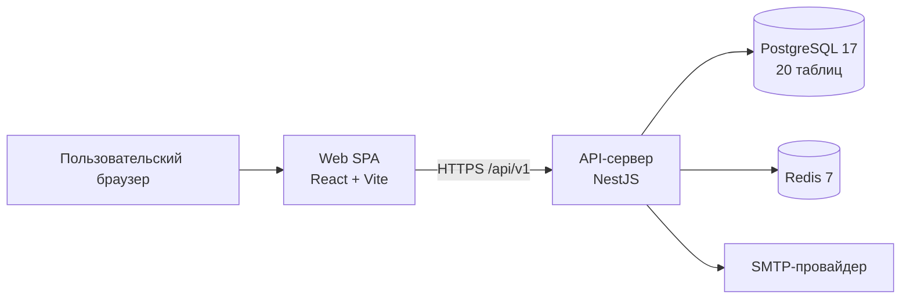

### 2.2 Архитектурный стиль

- Модель развертывания: monorepo (`npm workspaces`).
- Серверная часть: модульный монолит на NestJS.
- Клиентская часть: SPA с ролевой маршрутизацией.
- Персистентность: PostgreSQL (основные данные), Redis (кэш и серверная корзина).

### 2.3 Репозиторная структура

```text
RentHub/
  apps/
    api/                          # Backend-приложение (NestJS)
      prisma/                     # schema.prisma, migrations, seed-скрипты
      src/
        common/                   # инфраструктурные компоненты (guards, filters, crypto, prisma)
        modules/                  # предметные модули (orders, cart, pricing, ...)
        main.ts                   # bootstrap и глобальные политики API
    web/                          # Frontend-приложение (React + Vite)
      src/
        pages/                    # сценарные экраны (public, auth, admin, me)
        components/               # UI и layout-компоненты
        lib/                      # API-клиент, hooks, stores, утилиты
  docker/                         # docker compose профили (dev/prod)
  docs/                           # прикладная и техническая документация
  .github/workflows/ci.yml        # pipeline непрерывной интеграции
```

## 💻 3. Технологический стек

<table>
<tr>
<td width="50%">

### Frontend
- ⚛️ **React 19** — UI библиотека
- ⚡ **Vite 6** — сборщик и dev-сервер
- 🛣️ **React Router 7** — маршрутизация
- 🔄 **TanStack Query 5** — серверное состояние
- 🐻 **Zustand 5** — клиентское состояние
- 🎨 **Tailwind CSS 4** — стилизация
- 🧩 **Radix UI** — компоненты

</td>
<td width="50%">

### Backend
- 🚀 **NestJS 11** — фреймворк
- 🔷 **TypeScript 5** — язык
- 🗄️ **Prisma 5** — ORM
- 🔐 **JWT** — аутентификация (httpOnly cookies)
- ✅ **class-validator** — валидация DTO
- 📝 **Swagger** — документация API

</td>
</tr>
<tr>
<td colspan="2">

### Infrastructure & DevOps
- 🐘 **PostgreSQL 17** — основная БД
- 🔴 **Redis 7** — кэш и корзина
- 🔒 **Helmet + CORS** — безопасность
- 🧪 **Vitest** — unit-тесты
- 🎭 **Playwright** — E2E-тесты
- 🔄 **GitHub Actions** — CI/CD
- 🐳 **Docker Compose** — локальная разработка

</td>
</tr>
</table>

## ⚙️ 4. Функциональная спецификация

### 4.1 🌐 Публичный контур

- 🏠 Главная страница, каталог, карточка оборудования
- 📂 Категоризация каталога с иерархическим деревом
- 📮 Форма обращения/заявки (`WEB_INQUIRY`)
- 🛒 Корзина и оформление заказа (`WEB_CART`)
- 📄 Публичные правовые документы и условия аренды

### 4.2 🔐 Контур авторизации и личного кабинета

- 🔑 Аутентификация по email и паролю
- 🔄 Обновление токенов (`refresh`), завершение сеанса (`logout`)
- 🔓 Восстановление пароля и верификация email
- 👤 Личный кабинет пользователя: профиль и собственные заказы

### 4.3 🎛️ Административный контур

<details>
<summary><b>Операционный контур заказов</b></summary>

- Создание, просмотр, изменение, маршрутизация статусов
- Редактирование позиций заказа
- Возврат, продление, назначение единиц склада

</details>

<details>
<summary><b>Каталожный контур</b></summary>

- Карточки оборудования
- Категории
- Тарифные тиры и ценовые операции

</details>

<details>
<summary><b>Складской контур</b></summary>

- Физические единицы оборудования
- Статусы технического состояния
- Сервисные записи обслуживания

</details>

<details>
<summary><b>Дополнительные модули</b></summary>

- 👥 Контур клиентов и платежей
- 📊 Контур аналитики и календарного мониторинга
- ⚙️ Контур системных настроек (организация, SMTP, шаблоны, правовые документы)

</details>

## 🗄️ 5. Предметная модель и логика данных

### 5.1 Ключевые сущности

- `User`, `PendingRegistration`, `PasswordResetCode`
- `Category`, `Equipment`, `CatalogItemPrice`, `PricingTier`
- `WarehouseItem`, `MaintenanceLog`
- `Client`
- `Order`, `OrderLine`, `OrderStatusLog`
- `Reservation`, `RentalExtension`
- `Payment`
- `OrgSettings`, `EmailTemplate`, `LegalDocument`

**Всего:** 19 бизнес-моделей, 20 таблиц в БД (+ служебная `_prisma_migrations`)

### 5.2 📊 Статусные модели

| Модель | Статусы |
|--------|---------|
| **Заказ** | `DRAFT` → `PENDING` → `CONFIRMED` → `ACTIVE` → `OVERDUE` → `DONE` / `CANCELLED` |
| **Источник заказа** | `MANUAL`, `WEB_CART`, `WEB_INQUIRY` |
| **Резерв** | `PLANNED` → `ACTIVE` → `RETURNED` / `CANCELLED` |
| **Складская единица** | `OPERATIONAL`, `BROKEN`, `RETIRED` |

### 5.3 🔗 Концептуальная ER-схема

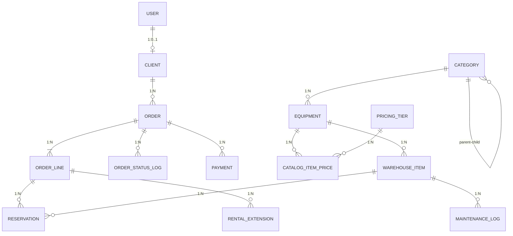

Схема базы данных в полном виде: [`apps/api/prisma/schema.prisma`](apps/api/prisma/schema.prisma)

> **💡 Tip:** Используйте Prisma Studio для визуального просмотра данных: `npm run db:studio`

## 🔧 6. Серверная архитектура API

### 6.1 🌍 Глобальные политики приложения

Реализованы на этапе bootstrap ([`apps/api/src/main.ts`](apps/api/src/main.ts)):

| Политика | Описание |
|----------|----------|
| 🔗 **API Prefix** | `/api` |
| 📌 **Версионирование** | URI-версионирование `v1` |
| 🍪 **Cookie Parser** | Поддержка httpOnly cookies |
| 🛡️ **Helmet** | Защита HTTP-заголовков |
| 🌐 **CORS** | Контроль `WEB_URL` |
| ✅ **Validation** | Глобальная DTO-валидация |
| 📝 **Swagger** | `/api/docs` с Basic Auth в production |
| 🔐 **Security** | Hard-fail для небезопасных JWT-секретов |

### 6.2 🧩 Модульная композиция

Композиция модулей зафиксирована в [`apps/api/src/app.module.ts`](apps/api/src/app.module.ts):

- 📦 **Предметные модули**: `orders`, `cart`, `pricing`, `warehouse`, `clients`, `payments`, `analytics`
- 🔐 **Безопасность**: `auth`, `users`, `me`
- 🔌 **Интеграции**: `notifications`, `scheduler`, `health`, `org-settings`, `legal`, `email-templates`

### 6.3 ⚡ Инварианты серверной части

- ✅ Строгая role-based авторизация (`ADMIN`, `MANAGER`, `USER`)
- 🔄 Транзакционность критических операций заказа
- 🔒 Контроль конкурентного доступа через advisory lock PostgreSQL
- 🎯 Нормализация статусов через state-machine переходы
- 🏭 Разделение технического состояния и фактической занятости склада

## 🎨 7. Клиентская архитектура

### 7.1 🛣️ Маршрутизация

Клиентская маршрутизация ([`apps/web/src/router.tsx`](apps/web/src/router.tsx)):

| Контур | Маршруты |
|--------|----------|
| 🌐 **Публичные** | `/`, `/catalog`, `/equipment/:id`, `/contact` |
| 🔐 **Аутентификация** | `/login`, `/forgot-password`, `/reset-password`, `/verify-email` |
| 👤 **Личный кабинет** | `/me/*` |
| 🎛️ **Админ-панель** | `/admin/*` (с ролевыми ограничениями) |

### 7.2 🐻 Клиентский стек состояния

- 🔄 **Серверное состояние**: TanStack Query
- 💾 **Локальное UI-состояние**: Zustand
- 🌐 **Транспорт**: Axios с credentials

## 🔒 8. Безопасность

### 8.1 🔐 Аутентификация и сессия

- 🍪 Access/Refresh токены в `httpOnly` cookies
- 🔄 Серверный refresh-поток без хранения токена в JS
- 🔑 Пароли хэшируются с `bcrypt`

### 8.2 🛡️ Защита API-периметра

- ✅ Валидация входных DTO с запретом неописанных полей
- 👮 Ролевые guards и контекстные guards
- ⏱️ Rate limiting через `ThrottlerGuard`
- 🌐 CORS-политика фиксируется `WEB_URL`

### 8.3 🔐 Защита прикладных секретов

- 🔒 SMTP-пароль шифруется AES-256-GCM
- 🔑 Ключ шифрования: `SECRET_ENCRYPTION_KEY`
- ⚠️ Блокировка старта при дефолтных JWT-секретах в production

> **⚠️ Warning:** В production обязательно используйте сильные случайные значения для `JWT_ACCESS_SECRET`, `JWT_REFRESH_SECRET` и `SECRET_ENCRYPTION_KEY`

## 🧪 9. Контур тестирования и контроля качества

### 9.1 🔬 Unit-тестирование

- ✅ Backend unit-тесты на **Vitest**
- 📦 Покрытие: pricing, tiers, categories, warehouse, state machine, client-linking, crypto

### 9.2 🎭 End-to-End тестирование

- 🎯 E2E сценарии на **Playwright**
- 🧪 Проверка: публичные маршруты, аутентификация, админ-контур, API

### 9.3 🔄 CI pipeline

GitHub Actions ([`.github/workflows/ci.yml`](.github/workflows/ci.yml)):

```
✓ lint-typecheck
✓ test (unit)
✓ build
✓ e2e (PostgreSQL + Redis)
```


## 🚀 10. Развёртывание и окружение

### 10.1 🐳 Локальное окружение разработки

[`docker/compose.dev.yml`](docker/compose.dev.yml) поднимает:
- 🐘 **PostgreSQL**: `localhost:5434`
- 🔴 **Redis**: `localhost:6380`

### 10.2 🔑 Ключевые переменные окружения

<table>
<tr>
<td width="50%">

**База данных и кэш**
- `DATABASE_URL`
- `REDIS_URL`

**Сервер**
- `PORT`
- `NODE_ENV`
- `WEB_URL`

</td>
<td width="50%">

**Безопасность**
- `JWT_ACCESS_SECRET`
- `JWT_REFRESH_SECRET`
- `JWT_ACCESS_TTL`
- `JWT_REFRESH_TTL`
- `COOKIE_SECURE`
- `COOKIE_DOMAIN`
- `SECRET_ENCRYPTION_KEY`

**Swagger**
- `SWAGGER_USER`
- `SWAGGER_PASSWORD`

</td>
</tr>
</table>

> **💡 Tip:** Шаблон конфигурации: [`.env.example`](.env.example)

## ⚡ 11. Регламент запуска и управления

### 11.1 🚀 Инициализация проекта

```bash
# 1. Установка зависимостей
npm install

# 2. Запуск инфраструктуры (PostgreSQL + Redis)
npm run dev:db

# 3. Применение миграций
npm run db:migrate

# 4. Инициализация данных
npm run db:seed

# 5. Запуск приложения
npm run dev
```

> **🎉 Готово!** Откройте http://localhost:5173

### 11.2 📋 Перечень команд верхнего уровня (root)

| Команда | Назначение |
|---------|------------|
| 🚀 `npm run dev` | Одновременный запуск API и Web |
| 🎯 `npm run dev:all` | Запуск инфраструктуры dev + приложений |
| 🐳 `npm run dev:db` | Подъем PostgreSQL/Redis в dev |
| 🛑 `npm run dev:db:stop` | Остановка контейнеров dev-инфраструктуры |
| 📋 `npm run dev:db:logs` | Просмотр логов dev-инфраструктуры |
| 🔧 `npm run dev:api` | Запуск только API |
| 🎨 `npm run dev:web` | Запуск только Web |
| 🔄 `npm run db:migrate` | Применение dev-миграций Prisma |
| 📦 `npm run db:migrate:deploy` | Применение production-миграций Prisma |
| 🌱 `npm run db:seed` | Минимальная инициализация данных |
| 🎭 `npm run db:seed:demo` | Расширенная инициализация демо-данных |
| 🎨 `npm run db:studio` | Запуск Prisma Studio |
| 🔄 `npm run db:reset` | Полный reset БД и повтор миграций |
| 🔍 `npm run lint` | Статический анализ кода |
| ✅ `npm run typecheck` | Проверка типов TypeScript |
| 🧪 `npm run test` | Unit-тестирование workspaces |
| 🎭 `npm run test:e2e` | Запуск Playwright e2e тестов |
| 📦 `npm run build` | Сборка приложений |
| ✨ `npm run format` | Автоформатирование |
| 🔍 `npm run format:check` | Проверка форматирования |


<details>
<summary><b>📦 Backend-модуль (apps/api)</b></summary>

| Команда | Назначение |
|---------|------------|
| `npm run start` | Старт API |
| `npm run start:dev` | Dev-режим API |
| `npm run start:debug` | Debug dev-режим API |
| `npm run start:prod` | Старт production-сборки API |
| `npm run build` | Сборка API |
| `npm run lint` / `lint:fix` | Линтинг и автоисправление |
| `npm run typecheck` | Проверка типов |
| `npm run test` / `test:watch` / `test:cov` | Unit-тесты API |
| `npm run db:migrate` / `db:migrate:deploy` | Миграции Prisma |
| `npm run db:generate` | Генерация Prisma Client |
| `npm run db:seed` / `db:seed:demo` | Seed-сценарии |
| `npm run db:studio` / `db:reset` | Управление БД |

</details>

<details>
<summary><b>🎨 Frontend-модуль (apps/web)</b></summary>

| Команда | Назначение |
|---------|------------|
| `npm run dev` | Dev-сервер Vite |
| `npm run build` | Production-сборка frontend |
| `npm run preview` | Preview-сервер production-сборки |
| `npm run lint` / `lint:fix` | Линтинг и автоисправление |
| `npm run typecheck` | Проверка типов |
| `npm run test:e2e` / `test:e2e:ui` | E2E-тестирование Playwright |

</details>

## 👤 12. Учетные данные и доступы

### 12.1 После `db:seed`

Создается административная учетная запись:

| Роль | Email | Пароль |
|------|-------|--------|
| 👑 **Admin** | `admin@renthub.com` | `admin` |

### 12.2 После `db:seed:demo`

Дополнительно создаются:

| Роль | Email | Пароль |
|------|-------|--------|
| 👔 **Manager** | `manager@renthub.com` | `manager` |
| 👤 **Client** | `client@renthub.com` | `client123` |

> **🔗 Точка входа:** http://localhost:5173/login

## 🌐 13. Точки доступа

| Сервис | URL | Описание |
|--------|-----|----------|
| 🎨 **Web** | http://localhost:5173 | Frontend-приложение |
| 🔧 **API** | http://localhost:3001/api/v1 | REST API |
| 📚 **Swagger** | http://localhost:3001/api/docs | API документация |
| ❤️ **Health** | http://localhost:3001/api/v1/health | Health check |

## 📚 14. Документационный комплект

| Документ | Описание |
|----------|----------|
| 📖 [Техническая документация](docs/tech-doc.md) | Детальное описание архитектуры и реализации |
| 📘 [Руководство пользователя](docs/user-guide.md) | Инструкции для пользователей системы |
| 🚀 [Инструкция по развёртыванию](docs/DEPLOYMENT.md) | Гайд по production-развертыванию |

## 📸 15. Скриншоты

<details>
<summary><b>Посмотреть скриншоты интерфейса</b></summary>

### Публичная часть

#### Главная страница
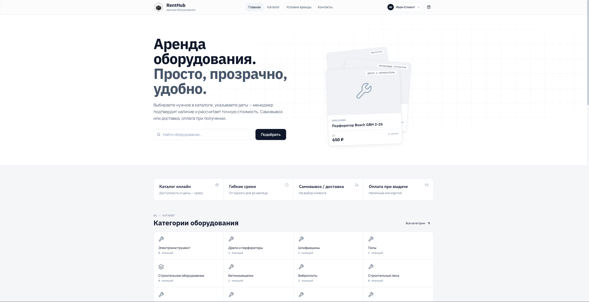

#### Каталог оборудования
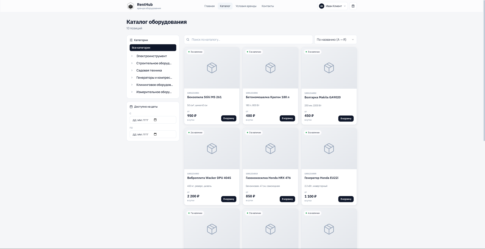

#### Карточка товара
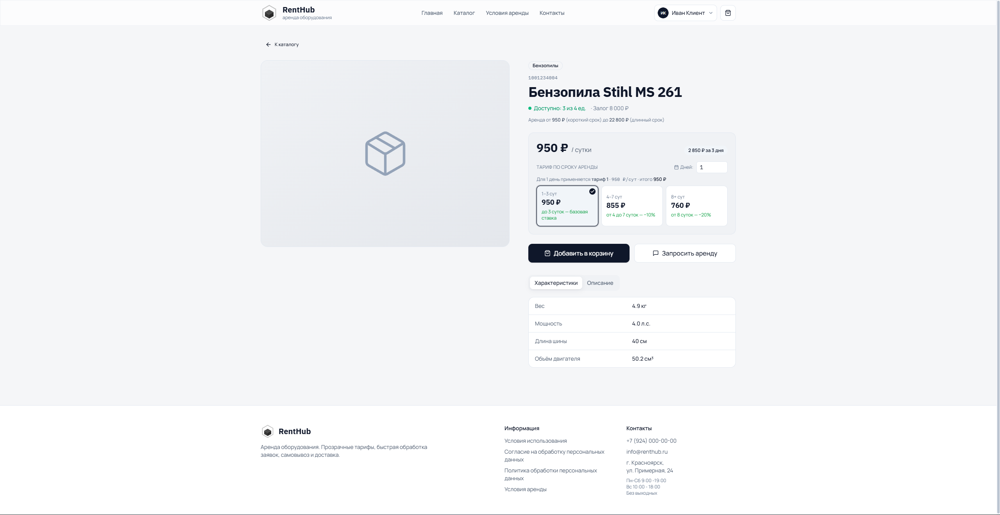

#### Регистрация
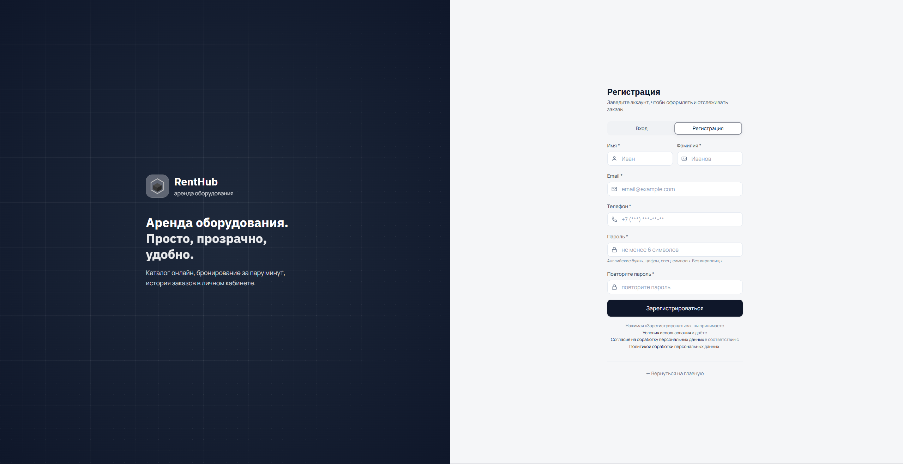

### Личный кабинет

#### Профиль пользователя
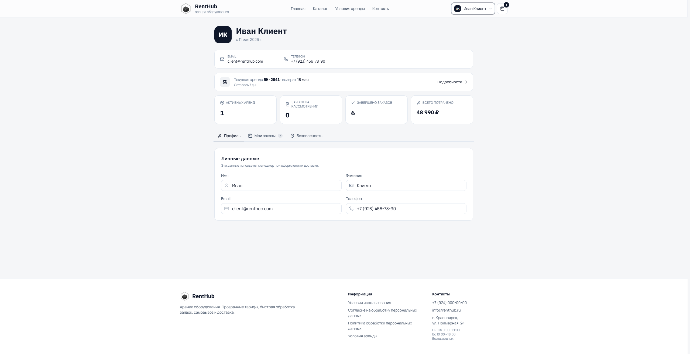

### Административная панель

#### Дашборд
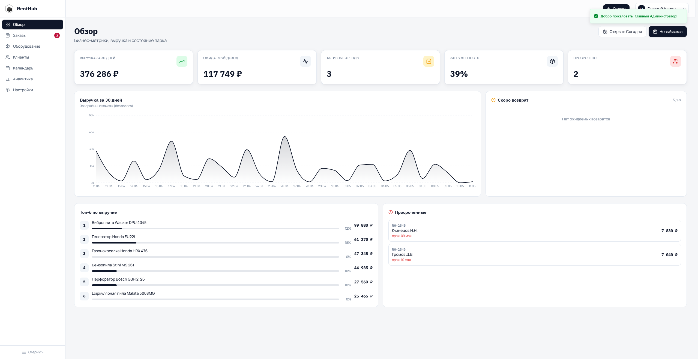

#### Детали заказа
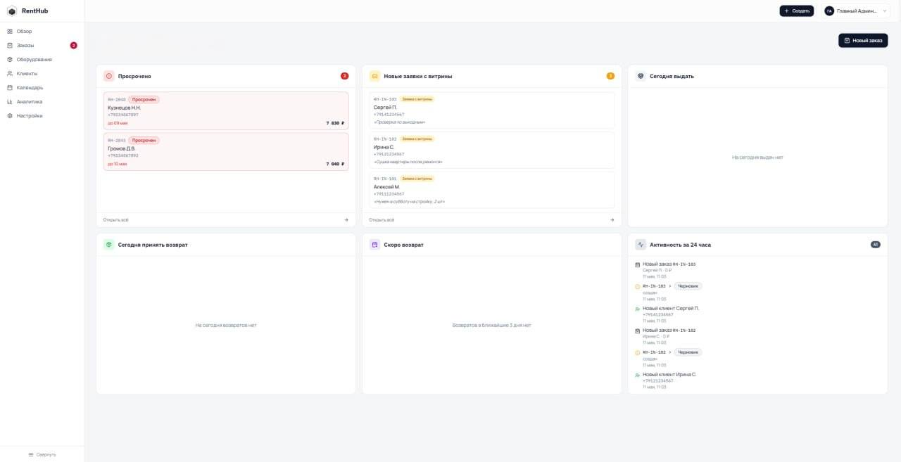

#### Календарь занятости
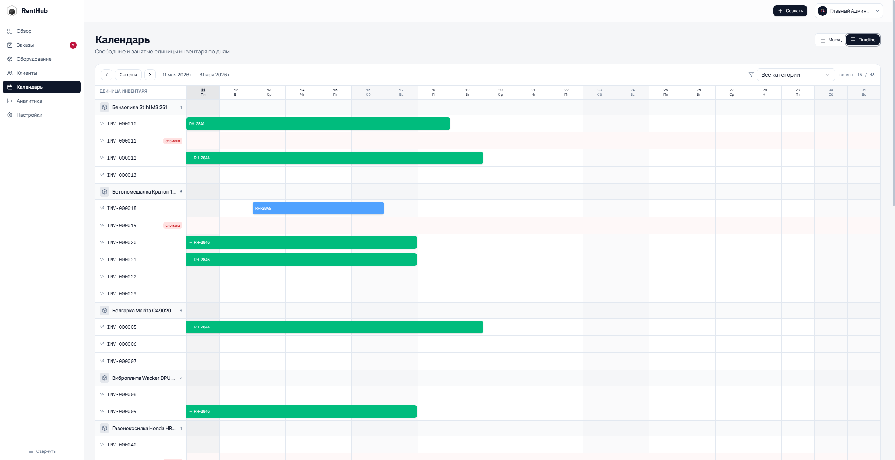

#### Складской учет
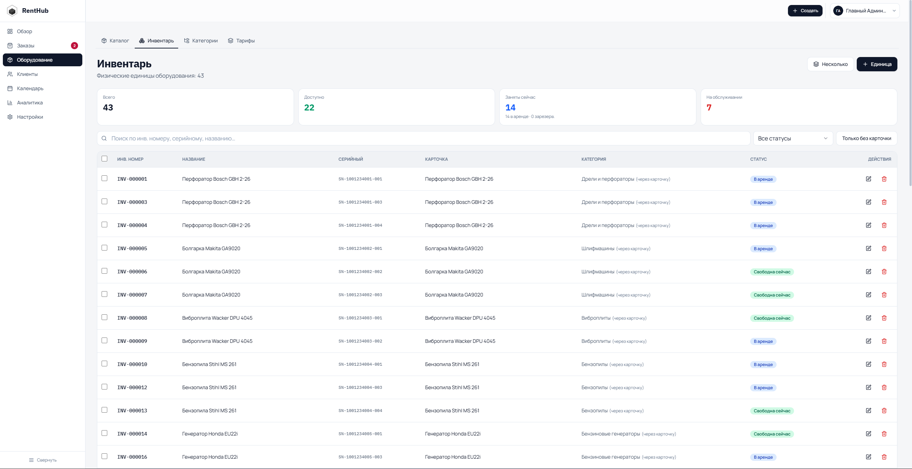

#### Публикация в каталог
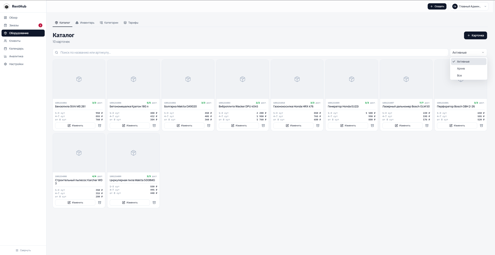

#### Структура категорий
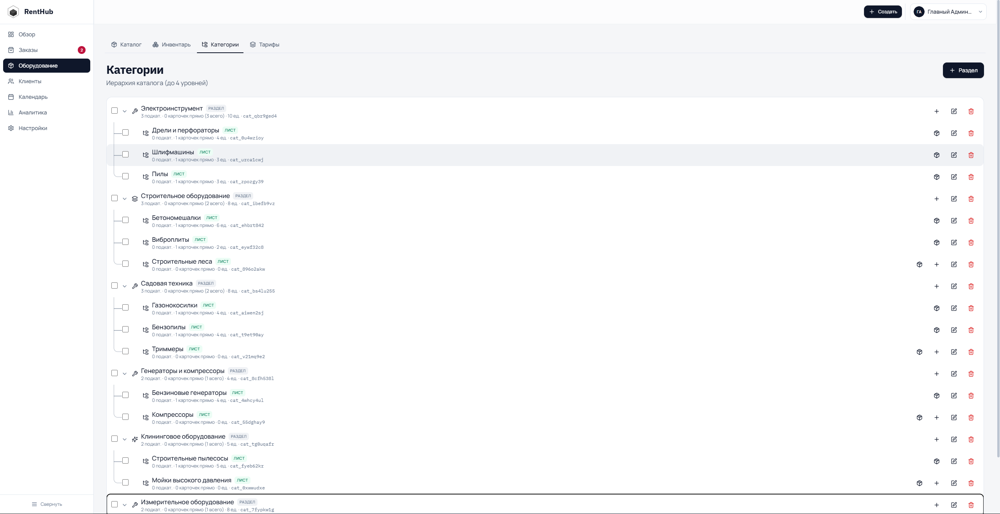

#### Аналитика
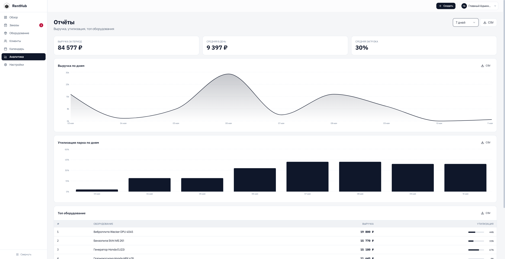

#### Настройка уведомлений
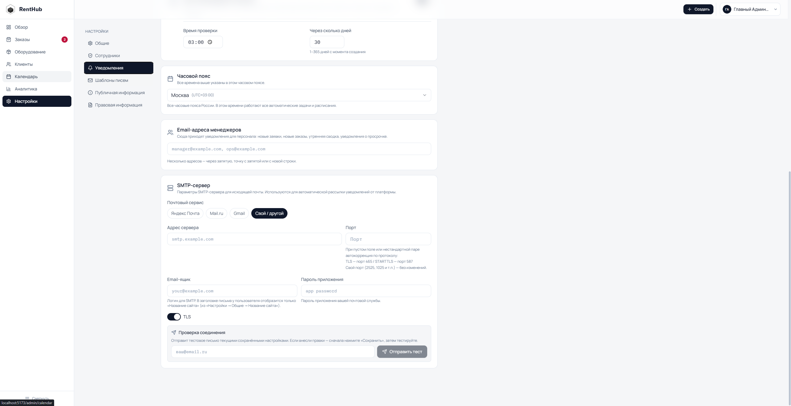

</details>

---

<div align="center">

[⬆ Наверх](#-renthub)

</div>
